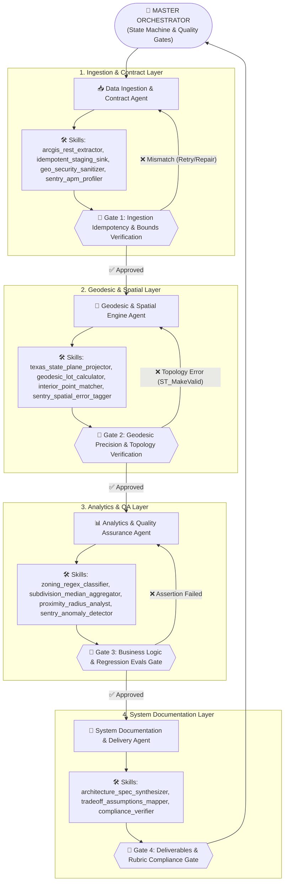

# AGENTS.md - Multi-Agent Architecture, Sentry Skills & Quality Gates

## 1. Multi-Agent Orchestration Overview

This repository is governed by a **4-Agent Collaborative Mesh**, where each autonomous agent is bounded by specific **Skills** (including native **Sentry APM & Observability Skills**), strict **Invariants**, and operates inside a **Closed Feedback Loop (Safety Gate)**.



---

## 2. Agent Roles, Specialized Skills & Sentry Integration

| Agent Name | Core Responsibilities | Skills Assigned (including Sentry) | Quality Gate & Safety Loop |
| :--- | :--- | :--- | :--- |
| **1. Data Ingestion & Contract Agent** | Connects to ArcGIS REST APIs, paginates feature feeds, validates schema contracts, and performs atomic database staging. | • `arcgis_rest_extractor`<br>• `idempotent_staging_sink`<br>• `geo_security_sanitizer`<br>• **`sentry_apm_profiler`** | **Gate 1:** Re-executes the ingestion pipeline 2 consecutive times. Measures HTTP latency spans with Sentry APM. Asserts identical row counts, zero primary key collisions, and Texas bounds compliance ($25^\circ \le \text{Lat} \le 37^\circ$). |
| **2. Geodesic & Spatial Engine Agent** | Projects geometries to EPSG:2277, repairs invalid polygon rings (`ST_MakeValid`), computes true planar lot acreage, and matches parcel centroids via `ST_PointOnSurface`. | • `texas_state_plane_projector`<br>• `geodesic_lot_calculator`<br>• `interior_point_matcher`<br>• **`sentry_spatial_error_tagger`** | **Gate 2:** Injects a synthetic $1000 \times 1000\text{ ft}$ square. Asserts computed lot size equals exactly $22.956841\text{ acres}$ (absolute error $< 0.000001\text{ ac}$). Attaches `parcel_id` and WKT to Sentry error context in case of topological anomalies. |
| **3. Analytics & Quality Assurance Agent** | Enforces the residential zoning rule `^(R|Residential)`, computes continuous medians (`PERCENTILE_CONT(0.5)`), filters lot sizes $> 1.0\text{ ac}$, and calculates 1 km proximity buffers. | • `zoning_regex_classifier`<br>• `subdivision_median_aggregator`<br>• `proximity_radius_analyst`<br>• **`sentry_anomaly_detector`** | **Gate 3:** Evaluates a 12-case Golden Dataset of tricky zoning strings. Triggers Sentry anomaly alerts if record volumes skew $> 200\%$ or non-residential zones leak into residential marts. |
| **4. System Documentation & Delivery Agent** | Synthesizes architectural design documents, assumption trade-off matrices, process methodology notes, and deliverables compliance checklists. | • `architecture_spec_synthesizer`<br>• `tradeoff_assumptions_mapper`<br>• `compliance_verifier` | **Gate 4:** Cross-references all generated Markdown artifacts against every evaluation criterion in the take-home assessment prompt to ensure 100% compliance. |

---

## 3. Sentry Observability & Error Intelligence Skills

The repository incorporates three dedicated Sentry skills implemented in `src/observability/sentry_integration.py`:

1. **`sentry_apm_profiler`**:
   - Instruments end-to-end distributed trace spans for external HTTP calls (`fetch_arcgis_zoning`), spatial indexing (`postgis_spatial_join`), and statistical queries (`calculate_median_percentiles`).
2. **`sentry_spatial_error_tagger`**:
   - Automatically enriches exception stack traces with geospatial metadata (`srid`, `polygon_vertex_count`, `parcel_id`, `calculated_sqft`) when topological repair is needed.
3. **`sentry_anomaly_detector`**:
   - Monitors execution invariants and captures security alert events for out-of-bounds bounding boxes, vertex overflows ($> 50,000$ vertices), and unexpected schema drift.

---

## 4. The 4 Closed Feedback Loops (Safety Gates)

```text
[Gate 1: Ingestion & Contract Gate]  ───▶ Ensures Idempotency & Rejects Out-of-Bounds Coords (Sentry Traced)
[Gate 2: Geodesic & Topology Gate]    ───▶ Validates EPSG:2277 Projection & Sub-Millimeter Area Accuracy
[Gate 3: Business Logic & Evals Gate] ───▶ Enforces Zero False-Positive Classifications & Statistical Sanity
[Gate 4: Deliverables & Rubric Gate]  ───▶ Confirms All 4 Take-Home Deliverables are Documented
```

### Self-Correction Mechanism:
- If **Gate 1** detects that an external feed is unreachable or returns malformed GeoJSON, it automatically engages the verified local sample fallback and tags the incident with structured JSON / Sentry logs.
- If **Gate 2** encounters a self-intersecting polygon ("bow-tie" ring), it triggers `shapely.validation.make_valid` / `ST_MakeValid` before attempting area computation.
- If **Gate 3** detects any non-residential zone in `mart_residential_gt_1ac`, it immediately halts execution with an assertion error.

---

## 5. Guidelines for AI Agents Modifying This Codebase

When modifying or extending this repository (e.g., during live coding interview exercises):
1. **Never read raw tabular area fields**: Always compute area dynamically from geometry projected to `EPSG:2277`.
2. **Never interpolate SQL strings**: Always use parameterized query bindings to maintain SQL-injection proofing.
3. **Keep Modules Decoupled**:
   - Ingestion changes $\rightarrow$ `src/ingestion/`
   - Spatial math / Matching $\rightarrow$ `src/spatial/`
   - Queries and Reporting $\rightarrow$ `src/analytics/`
   - Observability & Sentry $\rightarrow$ `src/observability/`
   - Evaluation checks $\rightarrow$ `src/evals/`
4. **Always Run the Safety Loops**:
   ```bash
   # Run all automated tests
   make test
   
   # Run the full pipeline and evaluation harness
   make run
   ```
