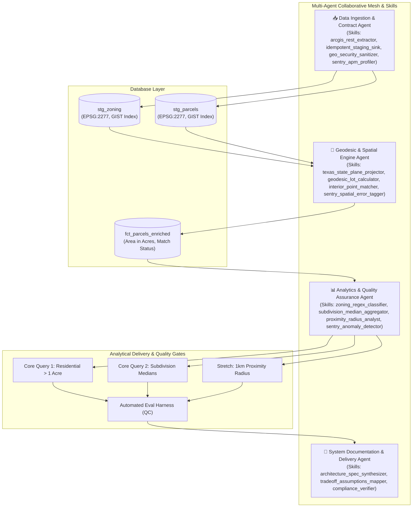

# Design Document: Geospatial Data Product (City of Buda & Hays County)

## 1. System Decomposition & Module Responsibilities

The system is decomposed into four decoupled, single-responsibility modules:

```text
┌─────────────────────────┐
│   1. Ingestion Layer    │ ➔ Fetches ArcGIS FeatureServer REST endpoints with pagination,
│ (Extract & Sanitize)    │   atomic staging, and security bounds/vertex sanitization.
└───────────┬─────────────┘
            │
            ▼
┌─────────────────────────┐
│   2. Spatial Engine     │ ➔ Reprojects polygons to Texas South Central (EPSG:2277 in feet),
│ (Projection & Area Calc)│   executes ST_MakeValid, and computes dynamic planar lot acreage.
└───────────┬─────────────┘
            │
            ▼
┌─────────────────────────┐
│   3. Relational & Join  │ ➔ Matches parcels to municipal zoning using ST_PointOnSurface,
│  (Point-on-Surface DB)  │   classifies residential status, and loads enriched fact tables.
└───────────┬─────────────┘
            │
            ▼
┌─────────────────────────┐
│   4. Analytics & Evals  │ ➔ Executes core queries (residential > 1 acre, median stats by area,
│   (Marts & QC Harness)  │   1km radius proximity) and runs automated regression evals.
└─────────────────────────┘
```

---

## 2. High-Level Architecture & Agentic Orchestration



---

## 3. Key Architectural Decisions & One-Line Rationales

| Decision | Rationale |
| :--- | :--- |
| **Local Planar Projection (EPSG:2277)** | Eliminates planar distortion in Texas South Central, ensuring exact physical area computation in survey feet. |
| **Dynamic Geometry Calculation (Ignore Source Area)** | Raw source area fields are notoriously uncurated, outdated, or in inconsistent units. |
| **`ST_PointOnSurface` over `ST_Centroid`** | Guarantees that representative points for concave or L-shaped lots fall strictly inside the parcel boundary. |
| **Multi-Agent Orchestration with Quality Gates** | Isolates responsibilities across 4 specialized agents bounded by quality gates and self-correction. |
| **Dual Backend (DuckDB Spatial + PostGIS)** | Enables zero-dependency local CLI execution out-of-the-box while maintaining 100% production SQL/PostGIS parity. |
| **Strict SQL Parameterization & Vertex Caps** | Prevents SQL injection and protects spatial indexes against Denial-of-Service (*Geom Bombs*). |
| **Structured JSON Logging & Sentry APM** | Provides distributed tracing, execution duration profiling, and rich error context per polygon in production. |

---

## 4. Consciously Deferred Decisions (What We Chose Not to Build)

1. **Polygon Split Intersection for Multi-Zoned Lots:**
   - *Deferred*: We assigned single zoning by internal point rather than splitting parcel polygons into multi-part geometries via `ST_Intersection`. 
   - *Why*: Parcel boundaries are legal tax entities; slicing them creates fragmented sub-parcels without distinct tax IDs unless specifically required by the business.
2. **Heavy Distributed Spark / Ray Orchestration:**
   - *Deferred*: Sizing up the datasets (~35k parcels in Hays County, ~450 zoning polygons in Buda) indicates $< 100\text{ MB}$ of memory footprint. PostGIS with GIST indexes handles this in sub-second queries without Spark cluster overhead.
3. **Heavy Web UI / Frontend:**
   - *Deferred*: Focused 100% of engineering bandwidth on data integrity, geodesic accuracy, idempotency, and the evaluation harness as specified in the evaluation rubric.
